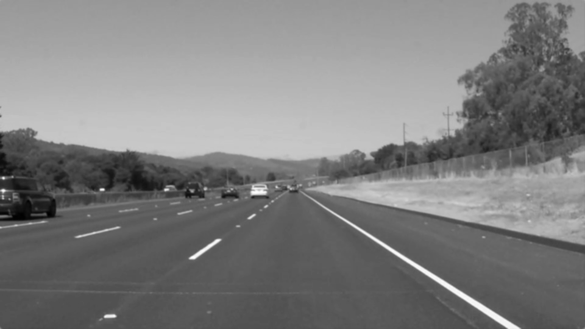
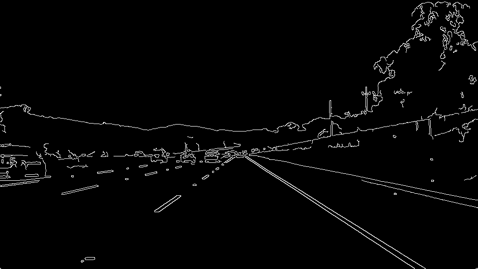
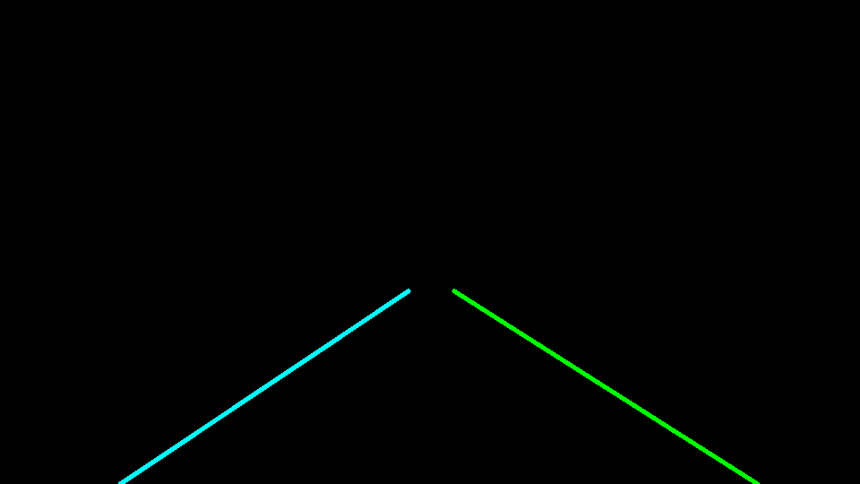

# **Finding Lane Lines on the Road** 

**Finding Lane Lines on the Road**

The goals / steps of this project are the following:
* Make a pipeline that finds lane lines on the road
* Reflect on your work in a written report

Delivarables
* Code for the project is in P1.ipynb
* Video output
  1. [Solid white right](./test_videos_output/solidWhiteRight.mp4)
  2. [Solid yellow lefy](./test_videos_output/solidYellowLeft.mp4)

---

### Reflection

### 1. Describe your pipeline. As part of the description, explain how you modified the draw_lines() function.

My Pipeline is explained in the series of steps below with intermediate images for those steps.

1. Gray Scale Conversion

2. Gaussian smoothing

3. Canny Edge detection

4. Masking Interesting polygon region

5. Hough transform

6. Drawing annotated images

### 2. Identify potential shortcomings with your current pipeline

1. Is very much dependent on lane width since we mask regions using hard coded parameters
2. Using hardcoded angles to filter out non lane edges is hacky
3. Does not work well when we are travelling around the curves. Lane lines are curved
4. Seems to have issues when there are shadows and color changes in the road, which leads to more edges detected. Since we try to fit line for all edges within certain degrees, we seem to fit wrong lines.

### 3. Suggest possible improvements to your pipeline

1. Not hardcoding lane width mask and instead trying to find the region mask based on edges detected.
2. Not hardcoding angles check for left lane line and right land line.

### 4. Attribution
1. Lots of weights were taken from the nanodegree course solutions.
2. Stackoverflow for numpy related functions
